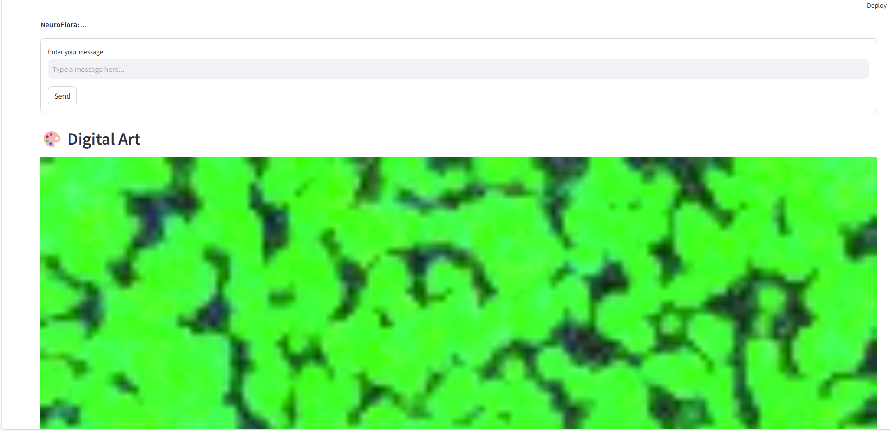

# NeuroFlora Mind Garden 🌿🧠

Test it at huggingface: 

https://huggingface.co/spaces/Aluode/NeuroFloraMindGarden

Welcome to NeuroFlora Mind Garden
Features
Interactive Conversations: Chat with NeuroFlora and see how it responds based on your inputs.

Dynamic Digital Art: Observe the evolving artwork that represents NeuroFlora's internal states.
Vital Signs Monitoring: Gain insights into NeuroFlora's criticality, dendritic complexity, memory capacity, emotional states, and skill levels.

Emotional States: Experience NeuroFlora's emotions like joy, curiosity, and energy influencing its interactions and creations.

Skill Development: Watch as NeuroFlora's skills in language, reasoning, and creativity grow through your conversations.

Reset Functionality: Start fresh anytime by resetting the conversation and NeuroFlora's state.

# How to Use

Start the Conversation

Enter your message in the input field at the bottom of the page.

Press the "Send" button to communicate with NeuroFlora.

Interact and Observe

Engage in meaningful conversations and see how NeuroFlora responds.

Notice the dynamic digital art updating in real-time based on the interaction.

Monitor Vital Signs

Check the Vital Signs section to understand NeuroFlora's internal states, including:

Criticality: Measures the system's balance between stability and change.

Dendritic Complexity: Indicates the intricacy of NeuroFlora's neural connections.

Memory Capacity: Reflects the number of patterns NeuroFlora has learned.

Emotional State: Displays current emotions influencing NeuroFlora's behavior.

Reset the Conversation

If you wish to start anew, click the "Reset Conversation" button.

This will clear the chat history and reset NeuroFlora's state, allowing for a fresh interaction.

Enjoy Your Journey with NeuroFlora!

Dive deep into an evolving digital ecosystem where your interactions help shape and grow NeuroFlora. Whether you're seeking engaging conversations or mesmerizing digital art, NeuroFlora Mind Garden offers a unique and enriching experience.

Licence MIT
